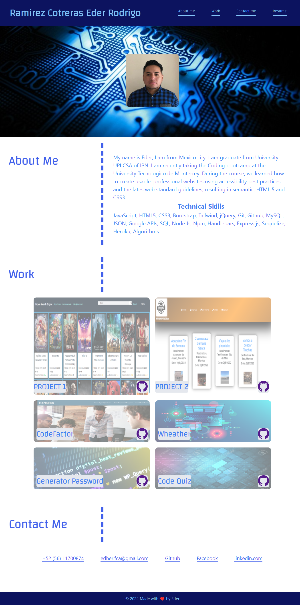

# Update Professional Portfolio
## Link to deployed application
 https://kdher.github.io/Professional-Portfolio/
## Your Task

This is my updated portfolio, here you can see the skills I have learned through the bootcamp.

## User Story

```
AS AN employer
I WANT to view a potential employee's deployed portfolio of work samples
SO THAT I can review samples of their work and assess whether they're a good candidate for an open position
```

## Mock-Up


